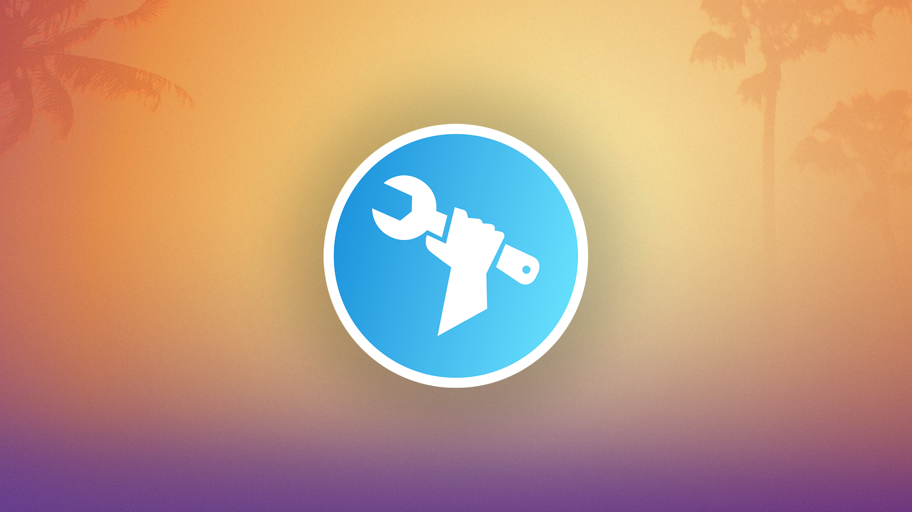

<div align="center">



# UEFN Helper — Website

**The official open-source website for the UEFN Helper Discord Bot.**  
Built with Next.js 14, TypeScript, and Tailwind CSS.

<br />

[](https://nextjs.org/) [](https://www.typescriptlang.org/) [](https://tailwindcss.com/) [](CONTRIBUTING.md)
[](LICENSE)

<br />

[**🌐 Live Site**](https://uefnhelper.frii.site) · [**🤖 Bot Invite**](https://discord.gg/) · [**💬 Discord**](https://discord.gg/) · [**🐛 Report Bug**](https://github.com/ItsMarwan/UEFN-Helper-Website/issues) · [**✨ Request Feature**](https://github.com/ItsMarwan/UEFN-Helper-Website/issues)

</div>

---

## 📋 Table of Contents

- [About](#-about)
- [Features](#-features)
- [Tech Stack](#-tech-stack)
- [Getting Started](#-getting-started)
  - [Prerequisites](#prerequisites)
  - [Installation](#installation)
  - [Environment Variables](#environment-variables)
  - [Running Locally](#running-locally)
- [Project Structure](#-project-structure)
- [Pages](#-pages)
- [Contributing](#-contributing)
- [License](#-license)

---

## 🧩 About

This is the open-source frontend for **UEFN Helper** — a Discord bot built for Fortnite UEFN (Unreal Editor for Fortnite) island builders. The website documents every bot command, explains pricing tiers, and provides a contact form for support.

The site is fully static-generation-ready, mobile responsive, and dark-mode only. It was designed to be easy to fork, customize, and self-host.

---

## ✨ Features

| Feature | Description |
|---|---|
| 📚 **Command Docs** | Full documentation for 50+ bot commands, organized by category |
| 🔍 **Category Filter** | Filter commands by category on the `/commands` page |
| 💰 **Pricing Page** | Three-tier comparison (Free, Premium, Enterprise) with FAQ |
| 📬 **Contact Form** | hCaptcha-protected form that sends emails via Resend |
| 🔒 **Legal Modals** | Privacy policy and Terms of Service open as popups (also accessible via `/privacy` and `/tos`) |
| 🗺️ **Sitemap + Robots** | Auto-generated sitemap and robots.txt |
| 📊 **Open Graph** | Full OG + Twitter Card metadata with banner image |
| ⚡ **Performance** | Static generation, minimal JS, fast page loads |
| 📱 **Responsive** | Mobile-first, works on all screen sizes |

---

## 🛠️ Tech Stack

- **Framework** — [Next.js 14](https://nextjs.org/) (App Router)
- **Language** — [TypeScript 5](https://www.typescriptlang.org/)
- **Styling** — [Tailwind CSS 3](https://tailwindcss.com/)
- **Email** — [Resend](https://resend.com/)
- **Captcha** — [hCaptcha](https://www.hcaptcha.com/)
- **Deployment** — [Vercel](https://vercel.com/)

---

## 🌐 Live Site

The UEFN Helper website is live at **[UEFNDevKit.rweb.site](https://uefndevkit.rweb.site)**

Features:
- Full command documentation with searchable categories
- Pricing and feature comparison
- Contact form with hCaptcha protection
- Open source and self-hostable

---

## 📁 Project Structure

```
├── app/
│   ├── layout.tsx              # Root layout — Navigation, Footer, LegalProvider
│   ├── page.tsx                # Home / landing page
│   ├── globals.css             # Global styles + animations
│   ├── commands/
│   │   └── page.tsx            # Commands listing with category filter
│   ├── docs/
│   │   ├── page.tsx            # Docs index (expandable categories)
│   │   └── [command]/
│   │       └── page.tsx        # Individual command documentation page
│   ├── invite/
│   │   └── page.tsx            # invite redirect page
│   ├── premium/
│   │   └── page.tsx            # Pricing / premium features page
│   ├── contact/
│   │   └── page.tsx            # Contact form with hCaptcha
│   ├── privacy/
│   │   └── page.tsx            # Redirects to /?legal=privacy (opens modal)
│   ├── tos/
│   │   └── page.tsx            # Redirects to /?legal=tos (opens modal)
│   ├── api/
│   │   └── contact/
│   │       └── route.ts        # Contact form API — hCaptcha verify + Resend
│   ├── sitemap.ts              # Auto-generated sitemap
│   └── robots.ts               # robots.txt
│
├── components/
│   ├── Navigation.tsx          # Top nav with mobile hamburger menu
│   ├── Footer.tsx              # Footer with legal modal triggers
│   ├── CommandCard.tsx         # Command display card
│   ├── LegalModal.tsx          # Privacy Policy + ToS modal content
│   └── LegalProvider.tsx       # Context provider for opening legal modals
│
├── lib/
│   └── commands.ts             # All 50+ command definitions + helper functions
│
├── public/
│   ├── icon.png                # Bot icon / favicon
│   └── images/
│       ├── banner.png          # OG banner (1200×630)
│       └── logo.png            # Bot logo used in hero section
│
├── .env.local.example          # Environment variable template
├── next.config.js
├── tailwind.config.js
├── tsconfig.json
└── postcss.config.js
```

---

## 📄 Pages

| Route | Description |
|---|---|
| `/` | Landing page — hero, features, pricing overview, CTA |
| `/commands` | All commands in a filterable grid |
| `/docs` | Docs index — expandable category sections |
| `/docs/[command]` | Full doc page for a single command |
| `/premium` | Pricing tiers + feature comparison + FAQ |
| `/contact` | hCaptcha-protected contact form |
| `/privacy` | Redirects home and opens Privacy Policy modal |
| `/tos` | Redirects home and opens Terms of Service modal |
| `/invite` | Redirects to the invite link of the bot |

---

## 🤝 Contributing

This is an open-source project! We welcome contributions. Whether it's fixing bugs, adding features, or improving documentation.

### Self-Hosting

To run this project locally or self-host it:

1. **Prerequisites:** Node.js `>=18.17.0` and npm `>=9`
2. **Clone:** Fork and clone the repository
3. **Install:** `npm install`
4. **Configure:** Set up your environment variables (see [.env.example](.env.example)):
   - `NEXT_PUBLIC_HCAPTCHA_SITE_KEY` — hCaptcha public key
   - `HCAPTCHA_SECRET_KEY` — hCaptcha secret key  
   - `RESEND_API_KEY` — Resend API key for contact form emails
   - `CONTACT_TO_EMAIL` — Recipient email for contact submissions

5. **Run:**
   ```bash
   npm run dev        # Development (http://localhost:3000)
   npm run build      # Production build
   npm start          # Production server
   npm run lint       # Check code quality
   ```

### How to Contribute

1. **Fork** the repository
2. **Create** a feature branch: `git checkout -b feat/your-feature`
3. **Commit:** `git commit -m "feat: description"`
4. **Push:** `git push origin feat/your-feature`
5. **Open a PR** on GitHub

### Adding or Updating Commands

All commands are defined in [lib/commands.ts](lib/commands.ts). Add a new command object:

```ts
'my-command': {
  name: 'my-command',
  description: 'Short description shown on cards',
  usage: '/my-command <required> [optional]',
  category: 'Category Name',
  permission: 'All',          // 'All' | 'Admin' | 'Manage Server' | 'Owner'
  premium: false,
  details: 'Full explanation shown on the doc page.',
  examples: ['/my-command example-value'],
  relatedCommands: ['other-command'],
},
```

The command will automatically appear on `/commands`, `/docs`, and get its own page at `/docs/my-command`.

### Guidelines

- Follow existing code style (TypeScript, Tailwind utilities)
- Keep components small and reusable
- Test on mobile before submitting
- One feature / fix per PR

---

## ⚠️ Security

This is an open-source project. If you discover a security vulnerability, **please report it privately** rather than opening a public issue.

See [SECURITY.md](SECURITY.md) for:
- Known vulnerabilities and their fixes
- Security best practices for self-hosting
- Recommendations for production deployment

---

## 📄 License

This project is licensed under the **VCL License** — see the [LICENSE](LICENSE) file for details.

You are free to fork, modify, and use this project for your own Discord bot website. Attribution is appreciated but not required.

---

<div align="center">

Made with ❤️ by [ItsMarwan](https://github.com/ItsMarwan)

**[⭐ Star this repo](https://github.com/ItsMarwan/UEFN-Helper-Website)** if you found it useful!

<br />

[](https://discord.gg/wfPfEw6b6w)

</div>