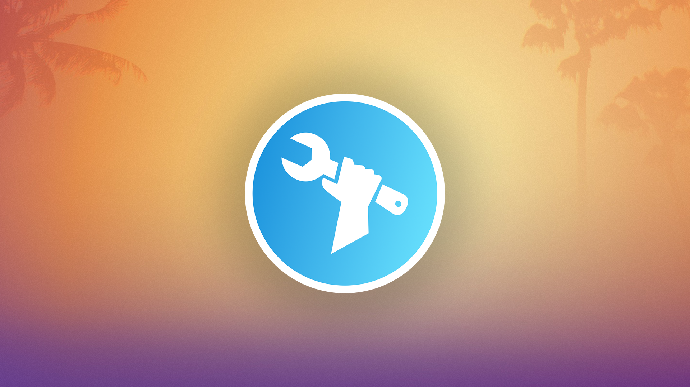

<div align="center">



# UEFN DevKit — Website

**The official website for UEFN DevKit, a powerful Discord bot designed for Fortnite UEFN island builders and community managers.**  
Built with Next.js 16, TypeScript, and Tailwind CSS.

<br />

[](https://nextjs.org/) [](https://www.typescriptlang.org/) [](https://tailwindcss.com/) [](CONTRIBUTING.md)
[](LICENSE)

<br />

[**🌐 Live Site**](https://uefndevkit.rweb.site) · [**🤖 Bot Invite**](https://discord.com/api/oauth2/authorize?client_id=123456789012345678&permissions=8&scope=bot%20applications.commands) · [**💬 Discord Server**](https://discord.gg/wfPfEw6b6w) · [**🐛 Report Bug**](https://github.com/ItsMarwan/UEFN-DevKit-Website/issues) · [**✨ Request Feature**](https://github.com/ItsMarwan/UEFN-DevKit-Website/issues)

</div>

---

## 📋 Table of Contents

- [🧩 About](#-about)
- [✨ Key Features](#-key-features)
- [🛠️ Tech Stack](#️-tech-stack)
- [🚀 Getting Started](#-getting-started)
- [📚 Documentation](#-documentation)
- [🤖 Bot Commands](#-bot-commands)
- [💰 Premium Tiers](#-premium-tiers)
- [🔌 API Reference](#-api-reference)
- [🏗️ Project Structure](#️-project-structure)
- [🤝 Contributing](#-contributing)
- [🔒 Security](#-security)
- [🇪🇺 GDPR Compliance](#-gdpr-compliance)
- [📄 License](#-license)
- [🙏 Acknowledgments](#-acknowledgments)

---

## 🧩 About

UEFN DevKit is a comprehensive Discord bot ecosystem designed specifically for Fortnite UEFN (Unreal Editor for Fortnite) island builders and community managers. The website serves as the central hub for:

- **Command Documentation** — Complete reference for all bot commands
- **Dashboard Access** — Web-based server management interface
- **Premium Features** — Advanced tools and priority support
- **API Integration** — RESTful API for third-party integrations
- **Community Support** — Help, contact forms, and Discord integration

The platform supports multiple tiers (Free, Premium, Enterprise) with escalating features and capabilities, making it suitable for communities of all sizes.

---

## ✨ Key Features

### 🎯 Core Functionality
- **Server Management** — Configure bot settings, roles, and permissions
- **Customer Tracking** — Monitor community members and their activity
- **Island Analytics** — Track Fortnite Creative island performance
- **Automated Moderation** — Keep your community safe and organized

### 💎 Premium Features
- **Advanced Analytics** — Deep insights into island performance and trends
- **AI-Powered Discovery** — Smart recommendations for content creation
- **Priority Support** — Fast-track assistance and custom integrations
- **Extended API Access** — Higher rate limits and additional endpoints

### 🔧 Developer Experience
- **RESTful API** — Full programmatic access to bot features
- **Webhook Integration** — Real-time notifications and automation
- **Comprehensive Documentation** — Detailed guides and examples

---

## 🛠️ Tech Stack

### Frontend Framework
- **Next.js 16** — React framework with App Router
- **TypeScript 5** — Type-safe JavaScript
- **Tailwind CSS 3** — Utility-first CSS framework

### Backend & Infrastructure
- **Supabase** — Database and authentication
- **Upstash Redis** — Rate limiting and caching
- **Vercel** — Deployment and hosting
- **Resend** — Email delivery service

### Security & Performance
- **hCaptcha** — Bot protection
- **Vercel Analytics** — Privacy-focused analytics
- **Rate Limiting** — API protection and abuse prevention
- **Security Headers** — Comprehensive security configuration

---

## 🚀 Getting Started

### Prerequisites
- Node.js 18+ and npm
- Git

### Installation

1. **Clone the repository**
   ```bash
   git clone https://github.com/ItsMarwan/UEFN-DevKit-Website.git
   cd UEFN-DevKit-Website
   ```

2. **Install dependencies**
   ```bash
   npm install
   ```

3. **Set up environment variables**
   ```bash
   cp .env.example .env.local
   ```
   Configure the following variables:
   - `NEXT_PUBLIC_SUPABASE_URL`
   - `NEXT_PUBLIC_SUPABASE_ANON_KEY`
   - `UPSTASH_REDIS_REST_URL`
   - `UPSTASH_REDIS_REST_TOKEN`
   - `RESEND_API_KEY`
   - `NEXT_PUBLIC_HCAPTCHA_SITE_KEY`
   - `HCAPTCHA_SECRET_KEY`

4. **Run the development server**
   ```bash
   npm run dev
   ```

5. **Open [http://localhost:3000](http://localhost:3000)** in your browser

### Build for Production
```bash
npm run build
npm start
```

---

## 📚 Documentation

### Website Pages
- **Home** (`/`) — Landing page with feature overview
- **Commands** (`/commands`) — Browse all bot commands by category
- **Docs** (`/docs`) — Detailed command documentation
- **Dashboard** (`/dashboard`) — Server management interface
- **Premium** (`/premium`) — Subscription plans and features
- **API Docs** (`/docs/api`) — Complete API reference
- **Contact** (`/contact`) — Support and feedback forms

### Key Components
- **CommandCard** — Reusable command display component
- **Navigation** — Responsive header with routing
- **ToastProvider** — Notification system
- **LegalProvider** — Terms of service and privacy modals

---

## 🤖 Bot Commands

The bot offers 50+ commands across multiple categories:

### 📊 Analytics & Tracking
- Island performance monitoring
- Player activity tracking
- Community growth metrics

### ⚙️ Configuration
- Server settings management
- Role and permission setup
- Integration configuration

### 👥 Member Management
- Customer database operations
- Role assignment automation
- Member analytics

### 🔧 Utilities
- Interactive help system
- Command synchronization
- System status checks

### 💎 Premium Commands
- Advanced island analytics
- AI-powered recommendations
- Extended automation features

---

## 💰 Premium Tiers

### Free Tier (€0)
- Core community management tools
- Basic island tracking
- Standard support
- 10 API requests/second
- 1,000 monthly API calls

### Premium Tier (€9.99/month)
- Advanced analytics dashboard
- AI-powered island discovery
- Priority email support
- 25 API requests/second
- 5,000 monthly API calls

### Enterprise Tier (€29.99/month)
- Full API access (all endpoints)
- Custom integrations
- Phone/video support
- 100 API requests/second
- 25,000 monthly API calls

---

## 🔌 API Reference

The REST API provides programmatic access to all bot features:

### Authentication
```bash
Authorization: Bearer {token}
X-Discord-Server-ID: {server_id}
Origin: {your_domain}
```

### Rate Limits
- **Free**: 10 req/sec, 1K/month
- **Premium**: 25 req/sec, 5K/month
- **Enterprise**: 100 req/sec, 25K/month

### Key Endpoints

#### Files Management
```http
GET  /api/files/list
POST /api/files/upload
GET  /api/files/download/{id}
```

#### Island Analytics
```http
GET  /api/islands/{id}/stats
GET  /api/islands/discovery
POST /api/islands/predict
```

#### Member Operations
```http
GET  /api/members
POST /api/members/{id}/roles
GET  /api/customers
```

#### Reports & Logs
```http
GET  /api/reports
POST /api/reports/create
GET  /api/command-logs
```

---

## 🏗️ Project Structure

```
uefn-devkit-website/
├── app/                          # Next.js App Router
│   ├── api/                      # API routes
│   │   ├── asset-access/         # Asset management
│   │   ├── dashboard/            # Dashboard endpoints
│   │   ├── discord-user/         # Discord integration
│   │   └── ...
│   ├── commands/                 # Commands page
│   ├── dashboard/                # Dashboard interface
│   ├── docs/                     # Documentation
│   └── ...
├── components/                   # Reusable React components
│   ├── CommandCard.tsx
│   ├── Navigation.tsx
│   ├── ToastProvider.tsx
│   └── ...
├── hooks/                        # Custom React hooks
│   ├── useBotHealth.ts
│   ├── useSupabase.ts
│   └── ...
├── lib/                          # Utility functions
│   ├── commands.ts               # Bot command definitions
│   ├── api.ts                    # API client
│   ├── pricing.ts                # Subscription logic
│   └── ...
├── public/                       # Static assets
│   ├── images/
│   ├── icons/
│   └── ...
├── scripts/                      # Build/deployment scripts
└── ...
```

---

## 🤝 Contributing

We welcome contributions! This project follows a structured contribution process:

### Ways to Contribute
- 🐛 **Bug Reports** — Use GitHub Issues with reproduction steps
- ✨ **Feature Requests** — Describe the enhancement you'd like
- 📝 **Documentation** — Improve guides, fix typos, add examples
- 💻 **Code Contributions** — Submit pull requests for fixes/features

### Development Workflow

1. **Fork & Clone**
   ```bash
   git clone https://github.com/your-username/UEFN-DevKit-Website.git
   cd UEFN-DevKit-Website
   ```

2. **Create Feature Branch**
   ```bash
   git checkout -b feat/your-feature-name
   ```

3. **Make Changes**
   - Follow TypeScript and Tailwind CSS conventions
   - Test on mobile and desktop
   - Run `npm run lint` before committing

4. **Commit & Push**
   ```bash
   git commit -m "feat: add your feature description"
   git push origin feat/your-feature-name
   ```

5. **Open Pull Request**
   - Provide clear description of changes
   - Reference related issues
   - Keep PRs focused on single features

### Adding Bot Commands

Edit `lib/commands.ts` and add to the commands object:

```typescript
'new-command': {
  name: 'new-command',
  description: 'Brief description for command cards',
  usage: '/new-command <required> [optional]',
  category: 'Category Name',
  permission: 'All', // 'All' | 'Admin' | 'Owner'
  premium: false,
  details: 'Detailed explanation for docs page',
  examples: ['/new-command example-value'],
  relatedCommands: ['other-command'],
}
```

### Code Standards
- **TypeScript** — Strict typing, no `any` types
- **Tailwind CSS** — Utility classes only, no custom CSS
- **Component Structure** — Small, focused, reusable components
- **Mobile-First** — Responsive design priority

---

## 🔒 Security

### Security Features
- **Rate Limiting** — API abuse protection
- **Input Validation** — Comprehensive data sanitization
- **Security Headers** — XSS, CSRF, and injection protection
- **Encryption** — Sensitive data protection

### Reporting Vulnerabilities
- **DO NOT** create public issues for security vulnerabilities
- Email security concerns to [uefndevkit@gmail.com](mailto:uefndevkit@gmail.com)
- Include detailed reproduction steps and impact assessment

### Security Best Practices
- Regular dependency updates
- Automated security scanning
- Secure deployment practices
- Privacy-focused analytics

---

## 🇪🇺 GDPR Compliance

Built with privacy and data protection in mind:

### ✅ Compliant Features
- **Explicit Consent** — Cookie consent banners
- **Essential Only** — No tracking without permission
- **Data Portability** — User data export capabilities
- **Right to Deletion** — Complete data removal
- **Privacy Policy** — Clear data usage disclosure

### Data Processing
- **Authentication Data** — Discord OAuth integration
- **Analytics** — Opt-in only, Vercel Analytics
- **Contact Forms** — Encrypted email delivery
- **API Logs** — Automatic cleanup (30 days)

---

## 📄 License

This project is licensed under the **Marwan Non-Commercial Contribution License (MNCCL) v1.0**.

### Permissions
- ✅ View, study, and learn from the code
- ✅ Personal and educational use
- ✅ Modify the code for personal use
- ✅ Submit contributions and improvements

### Restrictions
- ❌ Commercial use or monetization
- ❌ Creating competing products
- ❌ Redistribution outside this repository
- ❌ Using substantial portions in other projects

### Key Terms
- **Attribution Required** — Credit "ItsMarwan" as original author
- **Non-Commercial Only** — No revenue-generating activities
- **No Competitive Use** — Cannot create similar services
- **Contribution Terms** — All contributions licensed under MNCCL

See [LICENSE](LICENSE) for complete terms.

---

## 🙏 Acknowledgments

### Core Team
- **ItsMarwan** — Lead Developer & Project Founder
- **Community Contributors** — Bug fixes, features, and documentation

### Technologies & Services
- **Next.js** — React framework
- **Vercel** — Hosting and deployment
- **Supabase** — Database and auth
- **Discord** — Bot hosting and community

### Special Thanks
- Fortnite UEFN developer community
- Open source contributors
- Beta testers and early adopters

---

<div align="center">

**Built with ❤️ for the Fortnite UEFN community**

**[⭐ Star this repo](https://github.com/ItsMarwan/UEFN-DevKit-Website)** if you found it useful!

<br />

[](https://discord.gg/wfPfEw6b6w)

</div>
